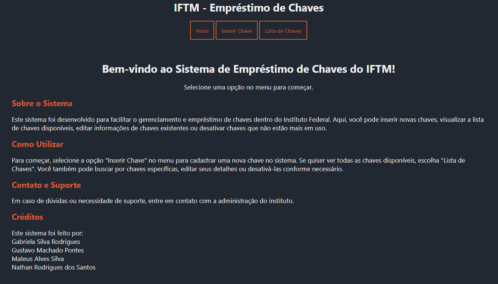
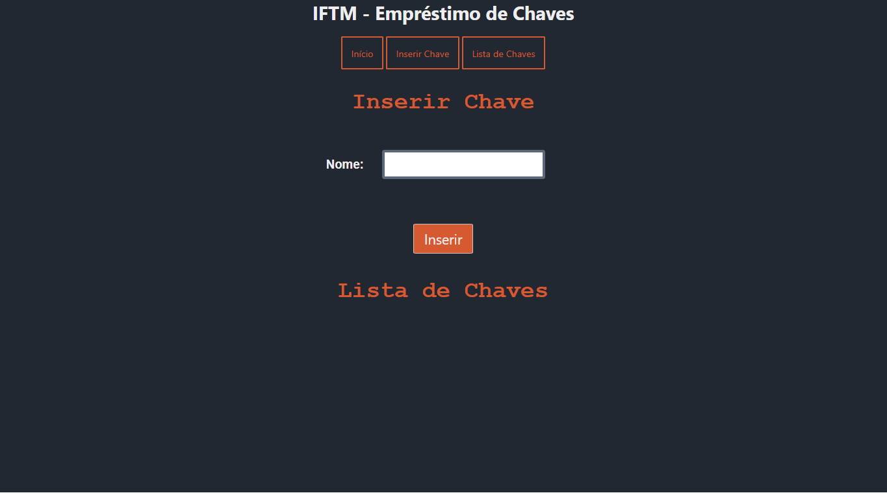
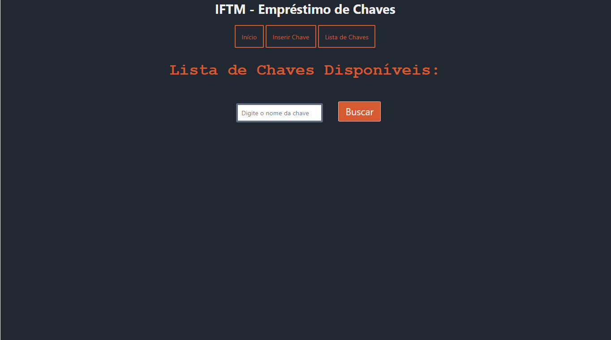

<h1 align="center">Emprestimo-de-Chaves</h1>

## 📖 About the project
Project for the "Web Applications Development 1" course. <br>
In this project, we developed a complete web program consisting of a back-end created with SpringBoot (Java) and MongoDB, while the front-end was built using Svelte. <br>
The software aims to manage the loan of keys, saving all key borrowing and return activities.

### Home page


### Insert page


### Keys list page


## 🦾 Technologies used
<div style="display: flex;">
 


</div>

## 🤔 What we learned
- We were able to enhance our skills in API integration.
- We built a clean and well-architected Database.
- We improved our UI/UX skills.
- We gained more knowledge about NoSQL Databases.

## 🧑‍🎓 Authors
- <a href="#"> Gabriela Silva Rodrigues </a>
- <a href="https://github.com/DevGustavus"> Gustavo Machado Pontes </a>
- <a href="#"> Mateus Alves Silva </a>
- <a href="#"> Nathan Rodrigues dos Santos </a>

## 👽 How to clone this project

````bash
    # Select where you want to clone
    $ cd ~/Documents/WHERE_YOU_WANT
````

````bash
    # Clone the project
    $ git clone https://github.com/M4teusAlves/Emprestimo-de-Chaves.git
````

````bash
    # Check if cloning worked fine
    $ cd ~/Documents/DIRECTORY_LOCATION
    $ ls
````
